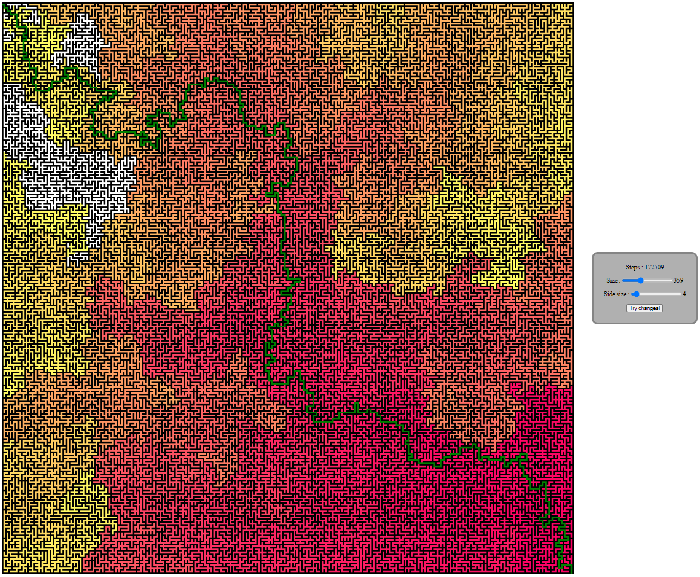

# 🔐 Maze Solver
Maze **generation** and **solving** with **customizable parameters**.



# 🔧 How to use
1. __Clone__ this repository manually or via the following command :
```
git clone https://github.com/Maximus220/maze-solver
```
2. __Launch__ the HTML file in your favorite browser.
3. __Have fun!__ 🎉

## 📜 TO-DO for future versions

 * Make an option to watch step by step (animation)
 * Make option to choose where are the entry/exit
 * Make option to choose the algorithm (tree, merge, ...)
 * And much more! *(feel free to give me even more ideas via [Twitter](https://twitter.com/Maximus_pro_)!)*
